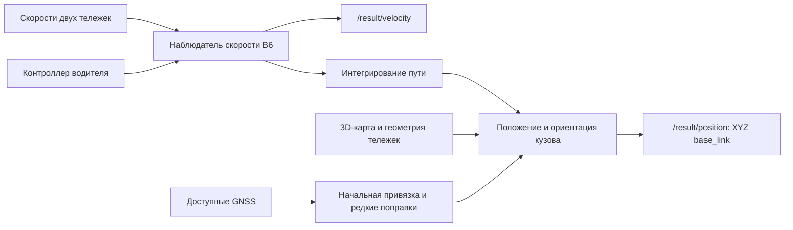

# Резервная одометрия трамвая

Оценка скорости и положения трамвая по скоростям двух тележек и положению контроллера водителя. Решение работает в ROS 2 Humble и публикует скорость в м/с и XYZ точки `base_link` в системе карты. Доступные GNSS используются для начальной привязки и редких поправок положения.

Выпуск **0.6**: [исходники](https://github.com/Nibani/tram-odometry-final/tree/main), [проверка ROS 2 Humble](https://github.com/Nibani/tram-odometry-final/actions?query=branch%3Amain).

## Материалы для сдачи

| Поле формы | Материал |
|---|---|
| 1. ROS-пакеты и сборка colcon | [reserve_odometry и tram_vehicle_msgs](src/) |
| 2. Запуск для жюри, запись и метрики | [Инструкция проверки](docs/JURY_RUNBOOK_RU.md) |
| 3. Уравнения, входы и выходы модели | [Математическая модель](docs/MODEL_RU.md) |
| 4. Допущения и настраиваемые параметры | [Параметры](docs/PARAMETERS_RU.md) |
| 5. Точность, быстродействие, таблицы и графики | [Результаты проверки](docs/ACCURACY_RU.md) |
| 6. Ограничения и дальнейшая работа | [Ограничения](docs/LIMITATIONS_RU.md) |

[Текст шести полей формы](docs/SUBMISSION_RU.md) · [Путеводитель по проекту](docs/PROJECT_GUIDE_RU.md) · [Задание и уточнения организаторов](docs/task/README.md)

## Как устроено решение

Наблюдатель B6 проверяет свежесть и согласованность колёсных каналов. Если измерения пригодны, скорость определяется по принятым каналам. При их отбраковке используется прогноз ускорения по контроллеру и предыдущей скорости. Модель ускорения обучена на TRAIN и сохранена в C++; дообучение при запуске не требуется.

Скорость интегрируется в пройденный путь. Трёхмерная карта и геометрия двух тележек задают положение и ориентацию кузова. Начальные GNSS выбирают привязку к карте, а последующие пригодные фиксации ограниченно корректируют положение. Эталон `/localization/kinematic_state` доступен только проверяющему скрипту; узел на него не подписывается.



Масса и фактический момент двигателя по имеющимся входам отдельно не идентифицируются. Модель предсказывает эффективное ускорение; положение контроллера не считается измерением момента. [Уравнения и границы этой модели](docs/MODEL_RU.md).

## Быстрый запуск

В Ubuntu 22.04 с установленными ROS 2 Humble и зависимостями:

```bash
git clone https://github.com/Nibani/tram-odometry-final.git
cd tram-odometry-final
git checkout main
source /opt/ros/humble/setup.bash
colcon build --executor sequential --cmake-args -DCMAKE_BUILD_TYPE=Release
source install/setup.bash
ros2 launch reserve_odometry odometry.launch.py use_sim_time:=true map_mode:=calibrated output_frame:=map
```

Во втором терминале с тем же ROS-окружением:

```bash
ros2 bag play /absolute/path/to/bag --clock
```

Путь указывает на каталог записи с `metadata.yaml`. Каждый независимый заезд нужно запускать новым процессом узла. Подробные зависимости, запуск официального чекера и сбор логов приведены в [инструкции жюри](docs/JURY_RUNBOOK_RU.md).

## Проверка и ограничения

На полном открытом примере: **XYZ RMSE 4.14 м**, **RMSE скорости 0.0568 м/с**, публикация позиции **99,77%** командных запросов. Это офлайн-результат общего C++-ядра; живой ROS-прогон проверяется отдельно. [Таблицы, график и условия измерений](docs/ACCURACY_RU.md).

До пригодной абсолютной привязки `/result/position` не публикуется; скорость и диагностика продолжают поступать. Поэтому ошибка положения рассматривается вместе с покрытием и задержкой первой публикации. Результаты открытых записей не предсказывают результат скрытой проверки.

Дополнительный детектор общей пробуксовки оставлен экспериментальной опцией и отключён по умолчанию после проверки короткого юза.

Основные ограничения — общая пробуксовка двух тележек, дрейф при длительной потере GNSS и ошибки карты, особенно на восстановленных конечных кольцах. Крен кузова принят нулевым. Состояния недоверия датчикам и восстановления привязки доступны в диагностических топиках.

## Данные и воспроизводимость

В репозитории находятся исходники, готовые карты, веса модели, изложение условий задачи и тесты с синтетическими входами. Полные архивы, контрольные суммы и порядок распаковки описаны в [data/README.md](data/README.md). Происхождение кода и материалов указано в [NOTICE.md](NOTICE.md).

Рабочий C++-узел не загружает веса или данные по сети и не требует Python ML-библиотек. Python и NumPy используются инструментами проверки; Matplotlib нужен для построения графиков.
