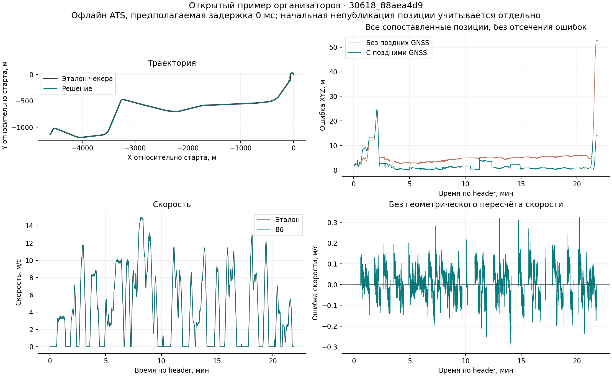

# Точность и быстродействие — выпуск 0.6

## Открытый проверочный пример

Прогон общего C++-ядра выполнен на числовых входах полного примера организаторов. Позиция сравнивается с XYZ base_link, скорость — с полем скорости официального эталона. Использовано сопоставление ATS по исходным меткам, без добавленного сдвига времени. Нулевая заданная задержка здесь означает только офлайн-расчёт, а не измеренную задержку ROS.

| Показатель | Результат |
|---|---:|
| RMSE положения XYZ | 4.138 м |
| Максимальная ошибка XYZ | 24.764 м |
| RMSE скорости | 0.05684 м/с |
| Смещение скорости | 0.00438 м/с |
| Максимальная ошибка скорости | 0.324 м/с |
| Публикации позиции / командные запросы | 26188 / 26249 (99.77%) |
| Сопоставленные скорости | 26233 |
| RMSE XYZ без поздних GNSS | 8.283 м |

Не опубликованы 61 начальная позиция до абсолютной привязки. После публикации все 26188 позиции сопоставлены с эталоном. Сопоставлены 26233 из 26249 скоростей; 16 выходов не нашли пару. Эталон поступает чаще, поэтому доля использованных эталонных сообщений не равна покрытию выхода.

[Числовой отчёт](../results/final/official_native.json) · [Без поздних GNSS](../results/final/official_no_late.json)

## Прежние поездки

Повторены 26 записей фиксированного разбиения. После первых 3 с оставлялись секундные GNSS-пакеты: master с 120 с каждые 120 с, rover с 60 с каждые 120 с. Поправки используют только доступные сообщения. Эти записи уже раскрыты при разработке, поэтому название holdout в файлах означает историческое разбиение, а не независимый скрытый тест.

| 30618 | XYZ RMSE на quality-парах | XYZ RMSE на всех valid-парах | RMSE скорости master |
|---|---:|---:|---:|
| Validation | 2.730 м | 3.101 м | 0.03421 м/с |
| Исторический holdout | 6.342 м | 6.450 м | 0.11795 м/с |

Quality-маска проверяет согласованность двух GNSS-антенн; она отбрасывает часть эталонных точек. Полные числа valid/quality, максимум, размеры выборок, обе антенны, 30639 и результаты каждой поездки сохранены в [old26.json](../results/final/old26.json). Ошибку на последней пригодной GNSS-паре нельзя выдавать за ошибку в истинном конце записи.

## Отказы и восстановление

Пройдены проверки геометрии, плеч антенн, меток времени, повторной инициализации, выбросов GNSS, асинхронных антенн, выхода за карту и возврата после потери GNSS. Отдельно проверены резкая общая пробуксовка, торможение, возврат к колёсам и отключение дополнительного детектора. Независимый сценарий короткого юза выявил регрессию экспериментального детектора: после восстановления колёс он увеличивал ошибку пути до −16,53 м вместо −6 м. Поэтому в итоговом запуске дополнительный детектор отключён; базовый B6 сохранён. [Полный журнал](../results/final/native_checks.txt), [сценарии](../tests/).

Проверки ограничены перечисленными сценариями. Общая согласованная ошибка антенн и плавная пробуксовка обеих тележек не гарантированно обнаруживаются. Ковариации эвристические.

## ROS 2 и производительность

Проверка точного исходного кода выполняется в Ubuntu 22.04 / ROS 2 Humble: сборка обычного и src-only workspace, тесты DDS В закрытой среде отдельно запущено воспроизведение полного примера в темпе 1× официальным чекером; числовой fixture не публикуется. [Текущий запуск CI](https://github.com/Nibani/tram-odometry-final/actions). До завершения этого запуска новые показатели задержки и ресурсов не заявляются. Исторические показатели других версий не переносятся на текущий выпуск.

Команды самостоятельного измерения, сохранение JSON, логов и выходного bag приведены в [инструкции жюри](JURY_RUNBOOK_RU.md). Частота, задержка доставки и время вычисления рассматриваются отдельно.

Баллы жюри и место на соревновании не вычисляются из этих таблиц: точная шкала перевода ошибок в баллы не предоставлена.
