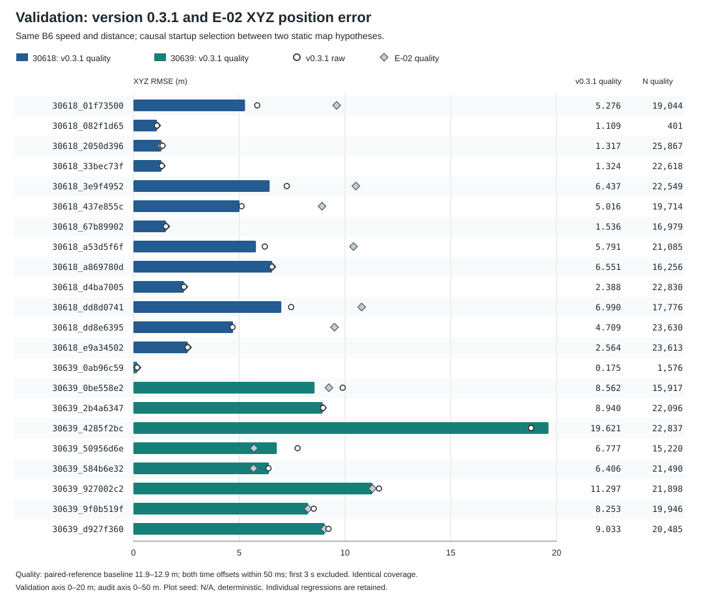
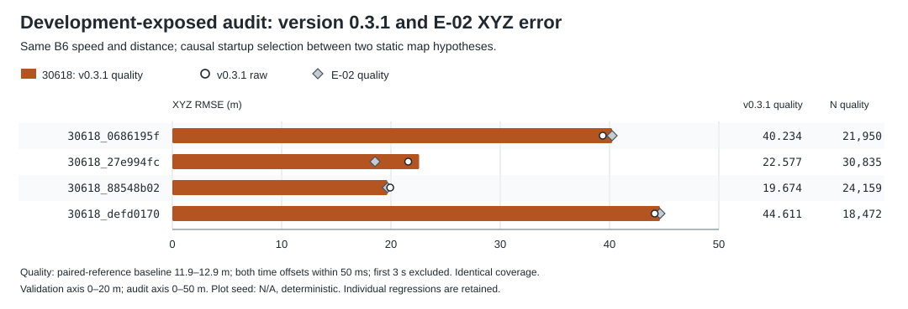

# Измеренная точность и пределы проверки

Дата отчёта: 26 сентября 2026 г. Текущая версия **0.3.1** использует B6, совместную XY-привязку двух GNSS-антенн, резервную ослабленную инициализацию и `speed_scale=1.0003350854241781`. В первые 3 с она выбирает одну из **двух статических гипотез карты**; после окна выбор заморожен. Базовый принятый пакет E-02 / версия 0.2 использует одну карту.

На validation quality XYZ RMSE снижена **8,737→7,663 м (−12,30%)**, raw XYZ — **9,000→7,863 м**. Speed RMSE неизменна: **0,046894 м/с**, абсолютная инициализация **22/22**. Выигрыш не равномерен: у 30618 XYZ RMSE **7,289→4,525 м (−37,92%)**, у 30639 — **10,612→10,885 м (+2,57%, ухудшение)**.

На открытом audit XYZ quality RMSE ухудшилась **31,093→31,944 м (+2,74%)**, raw — **30,450→31,294 м**. Speed RMSE осталась **0,117953 м/с**, инициализация **4/4**. Это объявленный компромисс, а не улучшение на всех данных. Audit участвовал в разработке; независимой скрытой проверки и подтверждения top 1–3 нет.

## Данные и статус эксперимента

Исходные 122 SQLite-записи содержат 97 уникальных заездов и 25 побайтовых дублей. Сохранено исходное разделение по датам: 71 train, 22 validation, 4 audit; контрольные суммы перечислены в `config/split_v1.json`. Для model fit, геопривязки официальной карты, достройки её терминалов и калибровки масштаба использовался TRAIN. Значение масштаба зафиксировано как медиана оценок 37 подходящих train-заездов до проверки этого кандидата на validation. Это общий коэффициент, без выбора по ID вагона, заезда или времени.

`wheel_divisor=3.6` задаёт перевод входных единиц; `speed_scale=1.0003350854241781` — отдельная небольшая калибровка результата B6 и интегрируемого пробега. Они не подменяют друг друга. Основной `route_loop.csv` сохранён; рядом добавлен `route_hairpin_hypothesis.csv`. `align_initial_position=false`, резервная инициализация разрешена. Приоритет имеет строгая начальная GNSS-пара; только при отсутствии строгих кандидатов используется ослабленная выставка с флагом 32. Точная модель и геометрия описаны в [MODEL_RU.md](MODEL_RU.md), настройки — в [PARAMETERS_RU.md](PARAMETERS_RU.md).

Гипотеза карты построена из 144 TRAIN-точек 36 заездов: локальная нормальная деформация XY на 220 м, шесть коэффициентов, C1-огибающая, Huber 0,5 и ridge 0,001. Исходная карта остаётся первым вариантом; при равенстве стартовой стоимости с допуском 1e−9 м² выбирается она. Это две приближённые формы карты, а не доказательство существования двух физических рельсовых ветвей. Метод и его TRAIN-проверки описаны в [MAP_HYPOTHESES_RU.md](MAP_HYPOTHESES_RU.md).

Validation служит выбору решения. Audit уже был раскрыт стартовым решением; затем его отказ инициализации повлиял на добавление fallback. Поэтому **audit теперь также development-exposed**, хотя в машиночитаемом split и аргументах скрипта исторически называется `holdout`. Отдельной независимой реальной выборки после этих решений не осталось.

Патч 0.3.1 меняет только офлайн-правило порядка GNSS-меток: первая запись и далее строго новые максимумы метки, с тем же отбором строк координат. Допуски, runtime и карты прежние. После исправления validation и все quality/speed-метрики совпадают точно; audit raw получил ещё 17 пригодных пар. Для сопоставимости сохранённые выходы E-02 также пересчитаны этим правилом. [Подробности и команды](REFERENCE_ORACLE_RU.md).

## Что считается ошибкой

Runtime использует GNSS fix только в начальном окне 3 с; поздние GNSS не корректируют движение. При offline-оценке эталон сопоставляется с выходной меткой ближайшим сообщением в пределах **±0,05 с**. Ретроспективное сопоставление эталона может смотреть по обе стороны метки и не является входом алгоритма. Сами runtime-сообщения воспроизводятся в порядке фактического поступления.

Для позиции оба GNSS fix независимо сопоставляются с выходной меткой. Их координаты переводятся в ENU с origin `(55.805°, 37.425°, 170 м)`. Положение передней тележки (`base_link`) восстанавливается из антенн master `(-9.873, 0, 3)` и rover `(2.563, 0, 3)` м при нулевом крене. Направление продольной оси даёт вектор master→rover; компенсация использует индивидуальные плечи антенн. В модели карты ориентация кузова задана хордой между тележками длиной 7,55 м. Предположение о нулевом крене и GNSS-ошибка входят в ограничения эталона.

Используются две маски парного эталона:

- **raw / valid:** оба сопоставления укладываются в ±0,05 с, восстановленная позиция конечна, первые 3 с исключены, есть абсолютная ENU-инициализация. Это не все исходные GNSS-сообщения.
- **quality:** та же маска и дополнительно `11.9 < ‖rover−master‖ < 12.9` м. Номинальная база — 12,436 м. Отсев зависит только от GNSS, а не от величины ошибки кандидата.

Quality проверяет взаимную согласованность антенн, но не абсолютную точность GNSS: общий сдвиг обеих антенн проходит такой фильтр. Обе оценки приводятся рядом. Большая или меньшая RMSE после фильтра возможна, поскольку меняется набор точек.

Для скорости используется горизонтальная GNSS-норма: master, а при полном отсутствии канала master — rover. Основная speed-метрика не использует фильтр длины антенной базы и не удаляет точки с расхождением GNSS-скоростей. Метрики относительно каждого приёмника показаны отдельно. Это оценка относительно скорости антенны, а не независимого датчика скорости передней тележки; на кривой и при различной задержке каналов возможна физическая разница.

Для XYZ и XY: `RMSE = sqrt(Σ‖prediction−reference‖²/N)`, `MAE = Σ‖prediction−reference‖/N`. MAE здесь — средняя длина вектора ошибки, а не среднее по осям. Для Z и скорости используются скалярные ошибки. Сводная RMSE объединяет все точки; среднее RMSE заездов приводится отдельно. Это последовательные коррелированные наблюдения, поэтому N нельзя трактовать как число независимых испытаний.

## Покрытие и исключения

| Набор / вагон | Заезды | Выходы | Первые 3 с | N speed | Нет speed ref | N paired raw | Нет paired ref | N quality | Отсев базы |
| --- | ---: | ---: | ---: | ---: | ---: | ---: | ---: | ---: | ---: |
| Validation / все | 22 | 473 162 | 1 331 | 442 786 | 29 045 | 464 487 | 7 344 | 413 827 | 50 660 |
| Validation / 30618 | 13 | 287 619 | 787 | 282 454 | 4 378 | 280 746 | 6 086 | 252 362 | 28 384 |
| Validation / 30639 | 9 | 185 543 | 544 | 160 332 | 24 667 | 183 741 | 1 258 | 161 465 | 22 276 |
| Открытый audit / все | 4 | 107 707 | 243 | 106 096 | 1 368 | 105 406 | 2 058 | 95 416 | 9 990 |
| Открытый audit / 30618 | 4 | 107 707 | 243 | 106 096 | 1 368 | 105 406 | 2 058 | 95 416 | 9 990 |

Отсутствие парного эталона считается после стартового окна: оно включает непопадание хотя бы одного fix в допуск или неконечный результат восстановления. Все raw/quality-точки текущего кандидата имеют абсолютную привязку: `uninitialized_reference_count=0` в обоих наборах. Доля вне открытой карты также равна нулю; для замкнутой карты это не доказывает её метрическую точность.

На validation fallback не использован ни в одном из 22 заездов. На audit флаг 32 установлен только в `30618_0686195f`; после стартового окна он сохраняется на всех 23 575 выходах этого заезда. Остальные три заезда прошли строгую инициализацию. Audit не содержит вагона 30639, его качество на этом наборе неизвестно.

Альтернативная карта выбрана в 10/22 validation-заездах: 6/13 для 30618 и 4/9 для 30639. На audit — только `30618_27e994fc`, то есть 1/4. По сохранённым выходам обе скорости, интегрированный пробег, временные метки и маска абсолютной инициализации точно совпадают с E-02; меняются карта, начальная фаза и восстановленная позиция.

## Сводные ошибки

Позиционные ошибки — метры; speed — м/с. Это текущая версия 0.3.1; XY и Z используют quality-маску. Сравнение с E-02 приведено отдельно.

| Набор / вагон | Speed RMSE | Speed MAE | XYZ raw RMSE | XYZ Q RMSE | XYZ Q MAE | XY Q RMSE | XY Q MAE | Z Q RMSE | Z Q MAE |
| --- | ---: | ---: | ---: | ---: | ---: | ---: | ---: | ---: | ---: |
| Validation / все | 0.046894 | 0.023818 | 7.863 | 7.663 | 4.899 | 7.174 | 4.774 | 2.692 | 0.542 |
| Validation / 30618 | 0.034211 | 0.021798 | 4.949 | 4.525 | 3.219 | 4.496 | 3.170 | 0.512 | 0.240 |
| Validation / 30639 | 0.063334 | 0.027376 | 10.904 | 10.885 | 7.525 | 10.016 | 7.280 | 4.262 | 1.013 |
| Открытый audit / все | 0.117953 | 0.052828 | 31.294 | 31.944 | 26.060 | 31.878 | 25.918 | 2.057 | 1.410 |
| Открытый audit / 30618 | 0.117953 | 0.052828 | 31.294 | 31.944 | 26.060 | 31.878 | 25.918 | 2.057 | 1.410 |

| Набор | Среднее bag RMSE Q | Худший bag RMSE Q | XYZ raw MAE | XY raw RMSE | Z raw RMSE | Master XYZ Q RMSE | Master XYZ Q MAE |
| --- | ---: | ---: | ---: | ---: | ---: | ---: | ---: |
| Validation | 5.912 | 19.621 | 5.180 | 7.414 | 2.620 | 7.570 | 4.842 |
| Открытый audit | 31.774 | 44.611 | 25.241 | 31.213 | 2.252 | 31.926 | 26.002 |

Скорость относительно отдельных приёмников и их взаимное расхождение рассчитаны на собственных доступных масках; разные N не допускают прямого толкования разницы RMSE как выигрыша модели.

| Набор / вагон | N master | RMSE к master | N rover | RMSE к rover | N обоих | RMS master−rover | MAE master−rover |
| --- | ---: | ---: | ---: | ---: | ---: | ---: | ---: |
| Validation / все | 442 786 | 0.046894 | 464 488 | 0.114692 | 435 939 | 0.118522 | 0.016687 |
| Validation / 30618 | 282 454 | 0.034211 | 280 670 | 0.102842 | 276 612 | 0.101632 | 0.015498 |
| Validation / 30639 | 160 332 | 0.063334 | 183 818 | 0.130730 | 159 327 | 0.143188 | 0.018753 |
| Открытый audit / все | 106 096 | 0.117953 | 105 616 | 0.115730 | 104 342 | 0.119774 | 0.015619 |
| Открытый audit / 30618 | 106 096 | 0.117953 | 105 616 | 0.115730 | 104 342 | 0.119774 | 0.015619 |

Расхождение master−rover включает выбросы, несинхронность и кинематику разных точек кузова; это не чистая оценка дисперсии шума GNSS.

## Поездки: Validation



Столбец — quality XYZ RMSE версии 0.3.1, белый кружок — её raw XYZ RMSE, серый ромб — quality XYZ RMSE E-02. Синий цвет — 30618, бирюзовый — 30639. Шкалы: validation 0–20 м, audit 0–50 м. Порядок по ID; plot seed: N/A, детерминированно. H=0 означает основную карту, H=1 — гипотезу.

| Заезд | H | N speed | N raw / Q | Speed RMSE | E-02 XYZ Q | 0.3.1 XYZ raw / Q | 0.3.1 XY Q | 0.3.1 Z Q | 0.3.1 XYZ Q MAE | Последняя Q |
| --- | ---: | ---: | ---: | ---: | ---: | ---: | ---: | ---: | ---: | ---: |
| 30618_01f73500 | 1 | 23 748 | 23 674 / 19 044 | 0.03084 | 9.606 | 5.851 / 5.276 | 5.252 | 0.497 | 4.114 | 1.669 |
| 30618_082f1d65 | 0 | 399 | 401 / 401 | 0.02161 | 1.109 | 1.109 / 1.109 | 1.081 | 0.247 | 1.109 | 1.101 |
| 30618_2050d396 | 0 | 26 431 | 26 379 / 25 867 | 0.02957 | 1.317 | 1.373 / 1.317 | 1.215 | 0.508 | 1.037 | 2.377 |
| 30618_33bec73f | 0 | 23 348 | 23 256 / 22 618 | 0.04016 | 1.324 | 1.342 / 1.324 | 1.126 | 0.697 | 1.082 | 6.698 |
| 30618_3e9f4952 | 1 | 25 841 | 25 863 / 22 549 | 0.03024 | 10.513 | 7.248 / 6.437 | 6.426 | 0.376 | 5.023 | 3.505 |
| 30618_437e855c | 1 | 22 478 | 22 446 / 19 714 | 0.03188 | 8.915 | 5.113 / 5.016 | 4.977 | 0.627 | 3.652 | 2.980 |
| 30618_67b89902 | 0 | 19 505 | 19 117 / 16 979 | 0.02983 | 1.536 | 1.536 / 1.536 | 1.425 | 0.575 | 1.270 | 1.151 |
| 30618_a53d5f6f | 1 | 23 559 | 23 329 / 21 085 | 0.04043 | 10.401 | 6.208 / 5.791 | 5.781 | 0.344 | 4.678 | 3.332 |
| 30618_a869780d | 0 | 21 148 | 21 202 / 16 256 | 0.03045 | 6.551 | 6.543 / 6.551 | 6.545 | 0.278 | 5.789 | 32.784 |
| 30618_d4ba7005 | 0 | 23 074 | 22 830 / 22 830 | 0.02987 | 2.388 | 2.388 / 2.388 | 2.325 | 0.543 | 2.150 | 5.732 |
| 30618_dd8d0741 | 1 | 24 810 | 24 456 / 17 776 | 0.04976 | 10.789 | 7.456 / 6.990 | 6.966 | 0.580 | 5.216 | 2.512 |
| 30618_dd8e6395 | 1 | 24 372 | 24 180 / 23 630 | 0.03095 | 9.503 | 4.684 / 4.709 | 4.692 | 0.410 | 3.583 | 1.653 |
| 30618_e9a34502 | 0 | 23 741 | 23 613 / 23 613 | 0.02882 | 2.564 | 2.564 / 2.564 | 2.508 | 0.532 | 2.378 | 4.711 |
| 30639_0ab96c59 | 0 | 1 576 | 1 576 / 1 576 | 0.01386 | 0.175 | 0.175 / 0.175 | 0.174 | 0.019 | 0.175 | 0.167 |
| 30639_0be558e2 | 1 | 21 042 | 25 245 / 15 917 | 0.03919 | 9.239 | 9.892 / 8.562 | 8.537 | 0.642 | 5.857 | 8.249 |
| 30639_2b4a6347 | 0 | 20 156 | 22 162 / 22 096 | 0.03240 | 8.940 | 8.965 / 8.940 | 8.682 | 2.135 | 8.034 | 14.214 |
| 30639_4285f2bc | 1 | 21 695 | 25 324 / 22 837 | 0.06510 | 18.772 | 18.798 / 19.621 | 16.240 | 11.011 | 9.922 | 10.055 |
| 30639_50956d6e | 1 | 18 342 | 21 450 / 15 220 | 0.12162 | 5.697 | 7.761 / 6.777 | 6.727 | 0.818 | 5.616 | 14.637 |
| 30639_584b6e32 | 1 | 18 635 | 22 745 / 21 490 | 0.08885 | 5.677 | 6.383 / 6.406 | 6.347 | 0.865 | 5.252 | 11.173 |
| 30639_927002c2 | 0 | 21 354 | 22 824 / 21 898 | 0.03869 | 11.297 | 11.606 / 11.297 | 11.282 | 0.594 | 9.877 | 17.407 |
| 30639_9f0b519f | 0 | 19 604 | 20 554 / 19 946 | 0.03567 | 8.253 | 8.523 / 8.253 | 8.209 | 0.848 | 6.946 | 14.170 |
| 30639_d927f360 | 0 | 17 928 | 21 861 / 20 485 | 0.03510 | 9.033 | 9.221 / 9.033 | 9.008 | 0.669 | 8.021 | 13.921 |

## Поездки: Открытый audit



Столбец — quality XYZ RMSE версии 0.3.1, белый кружок — её raw XYZ RMSE, серый ромб — quality XYZ RMSE E-02. Оранжевый цвет выделяет открытый audit, все заезды — 30618. Шкалы: validation 0–20 м, audit 0–50 м. Порядок по ID; plot seed: N/A, детерминированно. H=0 означает основную карту, H=1 — гипотезу.

| Заезд | H | N speed | N raw / Q | Speed RMSE | E-02 XYZ Q | 0.3.1 XYZ raw / Q | 0.3.1 XY Q | 0.3.1 Z Q | 0.3.1 XYZ Q MAE | Последняя Q |
| --- | ---: | ---: | ---: | ---: | ---: | ---: | ---: | ---: | ---: | ---: |
| 30618_0686195f | 0 | 23 378 | 23 304 / 21 950 | 0.09387 | 40.234 | 39.378 / 40.234 | 40.155 | 2.525 | 34.455 | 70.411 |
| 30618_27e994fc | 1 | 37 177 | 36 981 / 30 835 | 0.16138 | 18.542 | 21.580 / 22.577 | 22.522 | 1.582 | 20.276 | 29.813 |
| 30618_88548b02 | 0 | 24 825 | 24 519 / 24 159 | 0.04891 | 19.674 | 19.933 / 19.674 | 19.623 | 1.427 | 16.609 | 34.406 |
| 30618_defd0170 | 0 | 20 716 | 20 602 / 18 472 | 0.10819 | 44.611 | 44.132 / 44.611 | 44.528 | 2.728 | 38.101 | 83.319 |

## Ошибка последней оцениваемой точки

`endpoint` в JSON — ошибка **последнего доступного отсчёта quality-маски**, не обязательно последняя метка rosbag и не приращение ошибки от начала. Каждый заезд ниже имеет одинаковый вес. Текущая версия 0.3, все значения — метры XYZ.

| Набор / вагон | Заезды | Минимум | Медиана | Среднее | Максимум |
| --- | ---: | ---: | ---: | ---: | ---: |
| Validation / все | 22 | 0.167 | 5.221 | 7.918 | 32.784 |
| Validation / 30618 | 13 | 1.101 | 2.980 | 5.400 | 32.784 |
| Validation / 30639 | 9 | 0.167 | 13.921 | 11.555 | 17.407 |
| Открытый audit / все | 4 | 29.813 | 52.409 | 54.487 | 83.319 |
| Открытый audit / 30618 | 4 | 29.813 | 52.409 | 54.487 | 83.319 |

В validation последняя оцениваемая точка `30618_a869780d` имеет ошибку 32,784 м при XYZ RMSE 6,551 м: небольшая средняя ошибка не гарантирует малого конечного дрейфа. У `30639_4285f2bc` quality Z RMSE 11,011 м сохраняется после проверки антенной базы. Без более точного независимого эталона нельзя полностью разделить ошибки карты, алгоритма и GNSS. На audit ошибка последней оцениваемой точки достигает 83,319 м.

## Сравнения и принятое изменение

Основное парное сравнение — версия 0.3 против принятого E-02 / версии 0.2: одинаковые заезды, временные метки, эталонные маски, стартовые исключения и масштаб скорости. Здесь сравнение pooled-ошибок корректно. Отрицательное изменение означает улучшение, положительное — ухудшение.

| Набор / вагон | N quality | E-02 XYZ Q RMSE | 0.3 XYZ Q RMSE | Изменение | XYZ raw RMSE |
| --- | ---: | ---: | ---: | ---: | ---: |
| Validation / все | 413 827 | 8.737333 | 7.662695 | -12.299% | 9.000 → 7.863 |
| Validation / 30618 | 252 362 | 7.289133 | 4.525384 | -37.916% | 7.768 → 4.949 |
| Validation / 30639 | 161 465 | 10.612085 | 10.884884 | 2.571% | 10.610 → 10.904 |
| Открытый audit / все | 95 416 | 31.093122 | 31.943841 | 2.736% | 30.450 → 31.294 |
| Открытый audit / 30618 | 95 416 | 31.093122 | 31.943841 | 2.736% | 30.450 → 31.294 |

Заранее зафиксированный validation-критерий этой гипотезы требовал ≥5% улучшения общей XYZ RMSE, не более 5% ухудшения для каждого вагона, неизменных скорости/пробега/покрытия и 22/22 инициализаций. Он выполнен. Это критерий локального эксперимента, а не замена исходного требования R 20% или гарантии места на соревновании.

Компромисс объявлен явно: **30639 ухудшается на 2,57%, открытый audit — на 2,74%**. При этом отдельные заезды ухудшаются сильнее групповой сводки: `30639_4285f2bc` +4,52%, `30639_50956d6e` +18,95%, `30639_584b6e32` +12,85%. На audit новая гипотеза выбрана только в `30618_27e994fc`: 18,542→22,577 м, **+21,77%**. Меньшая стартовая стоимость не гарантирует меньшей ошибки на всём маршруте.

Новая гипотеза меняет локальные XY-координаты и увеличивает длину замкнутой карты примерно на 8,833 м. Поэтому при одинаковом интегрированном пробеге меняется положение и после выхода с изменённого участка. Этот результат нельзя приписывать улучшению wheel-speed observer: его выходы не изменились. Детали построения и TRAIN leave-date-out проверки — в [MAP_HYPOTHESES_RU.md](MAP_HYPOTHESES_RU.md). Исходная карта сама использовала TRAIN, поэтому такие проверки не являются независимой скрытой оценкой.

История E-02 также сохранена: переход на joint-XY и fallback ранее изменил validation XYZ Q 8,623690→8,737333 м (+1,318%) при неизменной скорости. Он повысил покрытие audit с 3/4 до 4/4. Старые pooled 27,874 м (`audit_final`, 73 466 quality-точек) и 31,093 м (`audit_joint`, 95 416 точек) нельзя напрямую ранжировать: прежняя оценка исключала 23 304 raw-reference точки четвёртого заезда. **Текущие** 31,093→31,944 м сравниваются уже на одинаковом полном покрытии.

Официальная карта без TRAIN-достроек не позволила абсолютную инициализацию ни в одном из 22 validation-заездов: **0/22, ENU RMSE не определена**. Раннее число около 3,6 км было ошибочным вычитанием относительных координат fallback из ENU и исключено. Оно не является baseline для заявления о выигрыше. Требование R о 20%-м улучшении относительно официальной карты **не доказано**; выигрыш 12,30% против E-02 не подменяет этот критерий. Top 1–3 **не подтверждён** без скрытых результатов организатора и других участников.

Попытка исправления только терминальной метрики пробега и стартовая per-run калибровка масштаба не входят в кандидат. Принятая новая гипотеза — отдельная геометрическая модель, обученная по TRAIN; текущий отчёт не объявляет универсального устранения накопленного дрейфа.

## Синтетические сбои скорости

Фиксированный native B6 проверен отдельно от карты и ROS, до выходного множителя speed_scale. Частота 20 Гц, длительность 30 с, базовая скорость 8 м/с; ошибка ниже считается на интервале 10≤t<19 с (180 точек). Фикстуры детерминированы. Полный файл: [speed_stress_final.json](../results/speed_stress_final.json), исполняемый тест: `tests/native_speed_stress.py`.

| Сценарий | RMSE, м/с | Max abs error, м/с |
|---|---:|---:|
| `clean` | 0 | 0 |
| `front_step` | 0 | 0 |
| `both_step` | 1.07357e-05 | 5.37721e-05 |
| `both_ramp_return` | 0.820552 | 1.88583 |
| `both_negative_ramp_return` | 0.821257 | 1.89022 |
| `both_smooth_sine` | 0.75 | 1.5 |
| `both_missing_1s` | 5.10346e-06 | 3.1103e-05 |
| `rear_missing_whole_run` | 0 | 0 |
| `unexpected_real_acceleration` | 1.55734e-07 | 3.8147e-07 |
| `real_accel_then_opposite_slip` | 0.0481083 | 0.24096 |
| `ambiguous_constant_with_slip` | 0.820552 | 1.88583 |
| `ambiguous_real_accel_with_slip` | 1.08162 | 1.5 |
| `nonfinite_wheel` | 0 | 0 |
| `timestamp_reset` | 0 | 0 |

PASS здесь означает прохождение структурных проверок, конечность неотрицательных выходов и точность контрольных чистых сценариев. Он **не означает** малой ошибки при произвольном общем проскальзывании. Два `ambiguous_*` сценария имеют побайтово одинаковые наблюдения и различную истинную скорость: после 13 с разность истин составляет 1,5 м/с. Поэтому любой алгоритм на этих входах имеет ошибку не менее 0,75 м/с хотя бы в одном из двух миров. Ошибки около 0,8–1,1 м/с открыто показаны и являются ограничением текущего решения.

## ROS / DDS: измерения текущей версии 0.3

Проверен коммит `81650eef11a317e112ee390a595a9e3fd12efd3b`: [CI run 36239255867 — SUCCESS](https://github.com/Nibani/tram-reserve-odometry/actions/runs/36239255867). Среда — ROS 2 Humble, контейнер `ros:humble-ros-base-jammy` на GitHub runner Ubuntu 22.04, Release-сборка. Источник чисел — [ros_humble_v03.json](../results/ros_humble_v03.json), извлечённый из исходного ZIP логов CI. Прошли пять smoke-сценариев и дополнительный DDS-тест **обеих установленных полноразмерных карт**. Это свидетельство относится к указанному исполняемому коду; последующая редакция отчёта не является новым запуском CI.

| Синтетический DDS-сценарий | Выходы | Средняя частота, Гц | p99 latency, мс | Max latency, мс | Max gap, мс | Peak node RSS, KiB | Средняя загрузка, CPU cores |
| --- | ---: | ---: | ---: | ---: | ---: | ---: | ---: |
| Без карты, контроллера и GNSS | 165 | 19.99999 | 0.255872 | 0.285707 | 50.0176 | 24 620 | 0.006970 |
| Одна синтетическая прямая, поздний GNSS со сдвигом | 164 | 19.85886 | 0.771082 | 0.852347 | 121.2025 | 24 768 | 0.008110 |
| Две синтетические прямые, поздний GNSS на конкурирующей карте | 165 | 19.85051 | 0.758371 | 0.766075 | 101.1866 | 24 928 | 0.008258 |
| Две установленные полные карты, GNSS только в первые 3 с | 165 | 19.99894 | 2.569955 | 3.280595 | 51.6593 | 25 544 | 0.010986 |

В трёх smoke-сценариях колёсные входы соответствуют 5 м/с. При отсутствии контроллера публикация идёт по таймеру. В сценариях с прямыми картами контроллер дополнительно пропущен на интервале 4<t<5 с. После 3,5 с тест продолжает посылать заведомо изменённый GNSS: на одной карте — продольный сдвиг 100 м, на двух картах — переход с прямой y=5 м на полноценную конкурирующую прямую y=0 м. Сохранение исходной траектории проверяет игнорирование позднего GNSS и замороженный выбор карты. Максимальные ошибки XY в этих двух синтетических опытах — соответственно `1.86269e-5` и `1.87800e-5` м.

Полноразмерный тест `tests/ros_fullmap.py` загружает через ament share установленные `route_loop.csv` и `route_hairpin_hypothesis.csv`: **по 10 991 вершине**, длины 11 036,255 и 11 045,087 м, обе замкнуты. Включены `closed_route=true` и принятый `speed_scale=1.0003350854241781`. Эталон задаётся через `map_geometry.Route.pose`: старт s=800 м на официальной центральной части, скорость 5 м/с, хорда 7,55 м и точные индивидуальные плечи обеих антенн с высотой 3 м. Колёсный вход равен `5×3.6/speed_scale=17.993970482768134`; это обеспечивает заданные 5 м/с после выходной калибровки. Контроллер в этом опыте поступает регулярно. Отправлены 160 отсчётов каждого колеса и 30 пар GNSS, последняя пара имеет метку 2,900521 с; после 3 с GNSS не передаётся.

Все четыре DDS-сценария из таблицы подают входы 20 Гц в течение 8 с после 2 с на установление соединений. Частота, latency и gap измеряются при **1<t<7,9 с**; первый переходный интервал и загрузка карт до входов в эту оценку задержки не входят. В полнокартовом тесте здесь 138 выходов; завершение начальной привязки около третьей секунды входит в окно. Позиция проверяется при **3,2<t<7,9 с**: 94 точки, все в `map_enu`, максимальная ошибка XYZ **`1.41125e-6` м** при пороге 0,3 м. Это точность воспроизведения согласованного синтетического эталона, **не точность на реальных GNSS-заездах** и не проверка выбора гипотезы на терминале. Общий счётчик 165 выходов включает точки вне измерительных окон и короткий хвост таймера после прекращения входов.

Процесс узла ограничен affinity до двух CPU; для полного теста проверены фактические CPU `[0,1]`. Максимальный измеренный node RSS — **25 544 KiB = 24,945 MiB**. Используется опрос Linux `VmHWM`, то есть наблюдённый максимум резидентной памяти процесса, а не сумма памяти всего окружения. `child_max_rss_kib=65864` относится к учёту дочерних процессов smoke-окружения, включая инструменты воспроизведения, и не подменяет node RSS. Средняя загрузка — CPU time дочернего процесса, делённое на полное время опыта с discovery и завершением; для полных карт это 10,4368 с наблюдения. Она не является пиковой загрузкой и не вычисляется только на окне 1–7,9 с.

Latency — время получения скорости подписчиком минус `header.stamp` выходного сообщения. При регулярном контроллере метка получена от текущих системных часов при создании входа; при отсутствии контроллера выходную метку задаёт таймер. Измерение включает обработку и DDS-доставку, но не неизвестную задержку физического сенсора до присвоения метки. Max gap считается отдельно между метками выходов: например, gap 121,203 мс в сценарии с пропуском контроллера и max latency 0,852 мс описывают разные величины. p99 — эмпирическая оценка на коротком окне, а не установленный предел редких задержек.

Проверка с `/clock` прошла три фазы с 49/49/48 выходами и обратными скачками 0,5/103,5 с. Также **PASS**: реальное воспроизведение синтетически созданной SQLite rosbag через `ros2 bag play --clock` с `rate=2`, 121 выход. Вместе с тремя сценариями таблицы это пять smoke-проверок; полнокартовый опыт проведён отдельно.

Наблюдаемая частота около 20 Гц превышает требуемые 10 Гц. Во всех четырёх измеренных DDS-сценариях p99 <100 мс, максимальная задержка <250 мс, gap <250 мс; node RSS существенно ниже 0,5 ГБ. Автоматический порог памяти теста — 512 MiB, средней загрузки — <2,01 CPU cores при affinity 2. Полный опыт закрывает проверку вычислительной нагрузки на двух картах реального размера, но охватывает только 8 с одной синтетической траектории на CI-хосте. Он не гарантирует те же показатели на компьютере судьи, на всех участках маршрута или при длительной внешней нагрузке.

Историческая проверка E-02 / версии 0.2 сохранена отдельно: коммит `4245ad7ba27d9da8216c1292c99a4b51c7982cca`, [CI run 36235515911](https://github.com/Nibani/tram-reserve-odometry/actions/runs/36235515911), файл `results/ros_humble_final.json`. Текущая таблица использует только новый запуск 0.3.

## Воспроизводимость и фиксация результатов

Cache/features получены повторным декодированием исходных 122 записей с проверкой 97 уникальных SHA-256. Для версии 0.3.1 сохранённые выходы проверенного runtime 0.3 пересчитаны новым офлайн-эталоном без переобучения и повторного запуска узла; результат в `results/validation_hypotheses/metrics.json` и `results/audit_hypotheses/metrics.json`; базовый E-02 сохранён в `validation_final` и `audit_joint`. Историческое имя `holdout` не меняет открытого статуса audit. Таблицы округлены; JSON содержит полную точность. SVG построены непосредственно из per-bag JSON текущей версии и E-02, без случайности.

Переносимый TRAIN-builder `scripts/build_hairpin_hypothesis.py` независимо воспроизвёл 39 центрально пригодных заездов, 36 локальных заездов / 144 точки, все шесть коэффициентов и исходный CSV побайтово. Проверены CRLF- и LF-варианты входной карты; выход явно записывается с CRLF и 9 знаками. Зависимости — NumPy и C++17 native-projector, без сохранённых исследовательских проекций. Метод: [MAP_HYPOTHESES_RU.md](MAP_HYPOTHESES_RU.md).

Команда из корня решения; Python ≥3.10, NumPy, предварительно собранный executable:

```bash
python3 scripts/reproduce.py --bags /absolute/path/to/data --work /tmp/tram-evaluation \
  --exe /absolute/path/to/pipeline_cli --parts validation holdout \
  --map-mode hypotheses --speed-scale 1.0003350854241781
```

Для парного воспроизведения исходной одной карты используйте `--map-mode loop` и другой каталог `--work`. Новые метрики записываются в `evaluation_validation` и `evaluation_holdout` внутри указанного work. Сборка и DDS-проверка: [JURY_RUNBOOK_RU.md](JURY_RUNBOOK_RU.md). Модель и ограничения: [MODEL_RU.md](MODEL_RU.md), [LIMITATIONS_RU.md](LIMITATIONS_RU.md).

| Объект | SHA-256 |
| --- | ---: |
| Native executable 0.3 | `174258d42a04688deeb59d9d12472682c13213c08a7ed02a92c98bcfbf957570` |
| route_loop.csv | `16c11b14e7d776fe572775b43c0e342b8ec028b8ed19628f1a95a50e2b7f320e` |
| route_hairpin_hypothesis.csv | `ebadd38dab45bf746c2cbe7914aa6a428a021ea5be961fcaa3a67c4c6dc881bb` |
| Scorer исходного replay 0.3 | `de421cffebc75f4dfeabab3df4c71101f2ef8a3536b5e0cf344923001c8d083c` |
| Reference geometry oracle 3.6 | `b003c19d1e7ca69262613db3b67eceb0b7a832570a92446ca7976dea822482ff` |
| Position rescorer 0.3.1 | `c723cbd2ebe6f3b2d6a4975acf3c699ebe0042e414e67e7cf5fa45387964c74d` |
| validation_hypotheses/metrics.json | `9044e5f7c3713f88d8753f41a05a36d50974e36edde5b4d56bd439784fa32092` |
| validation_final/metrics.json | `ab5802d5701d3512ffb1c7d385a2a926caa010a39aa8564bca867d08c83a4f7c` |
| audit_hypotheses/metrics.json | `6eadaf1445ff1c69dcbd02d391a3aac49e10b3971148797ba1466d4b139462ce` |
| audit_joint/metrics.json | `abfcff4f8c8ac5c1a37db6f878f0bbda7dfd4477d7c9e1d73427090e6ac11537` |
| ros_humble_v03.json | `ec0cb2874de72ba760efe800ab446e74a33e2b39703d4f03ef8235fc3cfbbcb0` |
| Исходный ZIP логов CI 36239255867 | `0571082e2ef3b5177ee0118ff72adcd598012930c7d0feb6f2811deaa759aca9` |
| ros_humble_final.json (исторический 0.2) | `07d8cc36868af847cb5961ff05c46708dee4fae1e264f3eb8a8511610b6f5b9b` |

Хеши двух CSV выше относятся к исходным файлам с CRLF. В Linux CI те же текстовые карты установлены с LF; их SHA-256 после канонизации CRLF→LF: `route_loop.csv` — `6ee15c70018210cf0e1474fddffd33bb6f460a93bb65bdccae16e7247d984ba0`, `route_hairpin_hypothesis.csv` — `93dfcca102101600d3347f04d968046d062782e59c43f71931a79873d2a4743f`. Эти значения совпадают с фактически загруженными картами в `ros_humble_v03.json`. Хеш native executable в таблице относится к offline-оценке, не к Linux ROS-бинарнику; для ROS зафиксированы коммит и исходные логи CI.

