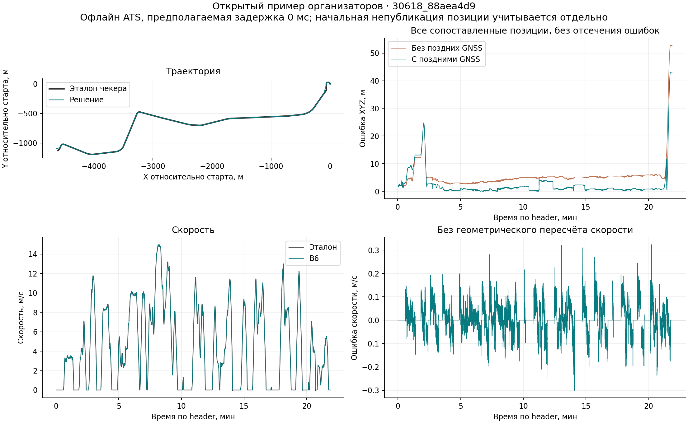

# Версия 0.4: новый проверочный пример и редкие GNSS

Дата: 27 сентября 2026. Данные организаторов: `check-code-with-bag.zip`, bag `30618_88aea4d9`, SHA256 `48f846d134d0584b38f9ca06b7ba812a16aeeecc896594313e3fa9acd27e10c3`. Это новый сентябрьский заезд, не дубликат прежних данных. После просмотра он считается открытым разработческим примером. По нему не обучались веса, карты или преобразование координат.

## Контракт и изменения

Организаторы уточнили: скрипты проверяют 30618, начальный GNSS гарантирован, редкие поздние GNSS разрешены, движение только вперёд. Позиция — XYZ base_link в координатах карты, включая её Z. `metrics.py` сравнивает скорость с `twist.twist.linear.x`, позицию — с `pose.pose.position` эталонного `/localization/kinematic_state`. Топик эталона служит только проверяющему скрипту. Пример `relay_result.py` не является частью решения.

1. Выходная ENU-позиция и ориентация переводятся в координаты Pathgraph фиксированным TRAIN-преобразованием: поворот XY −0,023073775662649332 рад, сдвиг `(101281,45326170324; 85499,06949541977; 169,99250112111588)` м. Это не подгонка по проверочному bag. Старые ENU-выходы напрямую несовместимы с числовым чекером; устранение этой несовместимости не следует выдавать за улучшение одометрического дрейфа.
2. Скорость конкурсного preset сохраняет прямую скалярную оценку B6 как приближение продольной скорости base_link. Проверенная экспериментальная проекция на ось хорды между тележками отвергнута как default: неточные производные достроенных терминалов создают выбросы. Она остаётся опцией `body_velocity_output:=true`. По независимому статическому/TRAIN-анализу все коэффициенты проекции ниже0,95 находятся в достроенных терминалах, а на официальных участках минимум0,9913. Карта и веса не менялись. Вектор twist Odometry остаётся геометрической оценкой; отдельный VelocitySensor — прямой оценкой наблюдателя, их различие явно допускается моделью приближений.
3. После инициализации каждая антенна независимо поправляет фазу вдоль выбранной карты и локальное XY-смещение. Сначала выполняется фазовый этап: Измерение сопоставляется с историей пути по собственной временной метке. Предсказанная позиция антенны включает её плечо и текущую ориентацию кузова. Пять локальных шагов проекции XY ищут поправку фазы; затем `Δs = clip(0,25·невязка_фазы, −5, +5)` м. Наблюдатель скорости и интеграл пройденного пути GNSS не изменяет.
4. В выбранном режиме остаточная XY-невязка после полной локальной проекции обновляет отдельный вектор `b`: `b ← b + clip_norm(0,25·residual_xy, 5 м)`. До следующего измерения `b ← b·exp(−Δdistance/100 м)`; на стоянке он не затухает. Постоянная начальная привязка карты сохраняется отдельно. Это модель локальной ошибки карты, а не глобальная подстройка пути. Начальная XY-невязка и остаток ограничены30 м, остаток не должен стать хуже исходного. При выключенной XY-коррекции прежний остаточный порог8 м сохранён. Отбрасываются невалидные, повторные, старые и будущие сообщения; максимальный возраст1 с, поиск фазы±30 м. Фаза и XY имеют отдельные пределы шага5 м: совместное перемещение может превысить5 м (на прямой контроль дал7,071 м). Общего жёсткого предела накопленного смещения нет. Добавочная поправка не имеет Z-компоненты; изменение фазы всё же меняет высоту по карте. Длина100 м зафиксирована до этой попытки и не подбиралась сеткой. Полная история двух попыток приведена ниже.
5. В конкурсном режиме до абсолютной инициализации нет публикации позиции. Скорость публикуется сразу. При неудаче первого окна sparse-режим повторяет выставку по свежим данным. Если пригодная пара так и не появится, абсолютного выхода не будет; гарантия любого GNSS не тождественна гарантии пригодной пары.

## Новый официальный пример: независимый офлайн-повтор правил

Длительность записи около 1309,59 с. 51563 входных сообщения и 65579 отдельных эталонных Odometry. Воспроизведён порядок SQLite `(record_time,id)`, точные int64 метки и правила двух независимых Humble ApproximateTimeSynchronizer: очередь100, строго меньше50 мс, порядок поступления, без интерполяции. Ни стартовая ошибка, ни большие ошибки не исключаются из официальной оценки; маска качества GNSS здесь не применяется.

Ниже предположение офлайн-проверки: выход приходит в момент обработки команды, добавочная задержка 0 мс. Это не измерение DDS.

| Вариант | XYZ RMSE, м | Максимум XYZ, м | RMSE скорости, м/с | Максимум ошибки скорости, м/с |
|---|---:|---:|---:|---:|
| Экспериментальная геометрическая скорость, поздние GNSS выключены | 8,283306 | 52,766909 | 0,060812 | 1,009971 |
| Геометрическая скорость, редкие GNSS включены | 6,953559 | 50,994918 | 0,060732 | 0,968714 |
| Прямая скорость B6, только фазовые GNSS-поправки | 6,953559 | 50,994918 | 0,056838 | 0,323604 |
| Выбранный preset: фаза + локальная XY-поправка100 м | 6,114867 | 43,088027 | 0,056838 | 0,323604 |

Выигрыш XYZ выбранного preset относительно адаптированного варианта без позднего GNSS — около26,18% при одинаковом покрытии. Фазовая коррекция отдельно давала16,05%; локальная XY-модель добавляет ещё12,06% относительно неё. На 26188 опубликованных позициях получено 26188 пар. 61 из 26249 командных выходов не публикует позицию из-за отсутствия завершённой выставки: покрытие99,7676%. Первый выход позиции через0,3036 с по времени поступления относительно первой команды и через3,0500 с по её header; различие обусловлено временными метками исходной записи. Скорость:26249 выходов,26233 пары. Эталон приходит чаще; пары составляют около40% его сообщений, что само по себе не означает потерю выходов.

Старая скалярная скорость B6 на тех же входах имела RMSE0,056838 м/с и максимум0,323604 м/с. Следовательно, геометрическая проекция ухудшает эти показатели на данном примере и не выбрана по умолчанию. Выбранный скаляр совпадает со старым B6 точно; это сохранение качества, а не улучшение наблюдателя скорости. Основная причина крупных всплесков — неточная локальная геометрия карты, а не изменение B6. Все временные метки, внутренние скорости и интеграл пути трёх веток совпадают точно. При дополнительных3 мс задержки выбранный preset даёт XYZ RMSE6,115978 м и speed RMSE0,054618 м/с; покрытие то же. Зависимость пар от прихода сообщений ожидаема, это не разница алгоритмов.

Большая ошибка XYZ в конце поездки почти целиком горизонтальная. Локальная XY-поправка уменьшает её, но не исправляет полностью неверную форму конечного кольца. Выходная Z RMSE выбранного preset —0,3924 м; у phase-only было0,3814 м (небольшое ухудшение из-за различий фазы). Скрытая точность и место1–3 не установлены.

## Прежние поездки: промежуточная фазовая коррекция

Сначала проверялась только фазовая коррекция, без локального XY. Её промежуточные цифры приведены в этой таблице; выбранный финальный вариант — в следующем разделе. Отдельная проверка, с другим эталоном: 22 прежних validation и4 ранее раскрытых audit. Входной GNSS оставлен в первые3 с, далее секундные окна master на120,240,… с и rover на60,180,… с. Расписание не зависит от ошибок. Оценка использует прежний парный GNSS-эталон после3 с, отдельно raw и контроль длины антенной базы (quality). Это нельзя смешивать с метрикой официального чекера.

| Набор | XYZ quality без/с поправками, м | XYZ raw без/с поправками, м |
|---|---:|---:|
| Validation,22 поездки | 7,6627 → 5,5991 | 7,8634 → 5,7859 |
| Из них30618,13 поездок | 4,5254 → 3,6273 | 4,9487 → 3,8810 |
| Из них30639,9 поездок | 10,8849 → 7,7321 | см. JSON по поездкам |
| Открытый audit,4 поездки30618 | 31,9438 → 6,8902 | 31,2939 → 6,9155 |

Quality RMSE улучшилась на всех26 поездках. Это не означает улучшение каждой точки: raw-максимум у validation30618 вырос61,65→63,11 м. Скорость и интеграл пробега совпадают точно между ветками. Никакого нового обучения/подбора на этих26 поездках не было. Файлы `results/v04/sparse_regression.json` и `sparse_plan.json` содержат SHA входов, все поездки, покрытия и максимумы.


## Выбор локальной XY-поправки и все компромиссы

Первая отдельная попытка сохраняла XY-смещение навсегда. На новом примере она дала XYZ RMSE5,663 м, но ухудшила validation30618 quality3,627→3,813 м и raw3,881→4,150 м. Она не выбрана. Это существенный отрицательный результат: лучшая цифра одного нового bag не определяет финальный preset.

Вторая и единственная следующая попытка ввела пространственное затухание за100 м. Параметры/исходники и критерий зафиксированы перед оценкой: улучшение нового примера и отсутствие ухудшения pooled quality validation30618. Критерий пройден; дальнейшего подбора длины не было. Это всё ещё разработческий выбор на раскрытых данных, не независимое подтверждение обобщения.

| Набор | Без поздних GNSS, quality XYZ | Только фаза | Выбранная фаза+XY100 м |
|---|---:|---:|---:|
| Validation,22 поездки | 7,6627 | 5,5991 | 5,0360 |
| Validation30618,13 поездок | 4,5254 | 3,6273 | 2,7482 |
| Validation30639,9 поездок | 10,8849 | 7,7321 | 7,2934 |
| Открытый audit30618,4 поездки | 31,9438 | 6,8902 | 6,3422 |

Raw XYZ выбранного варианта: validation5,3216 м, validation30618 3,1148 м, audit6,4500 м. Выборки и маски неизменны; ядро скорости и интеграл пути совпадают точно. Относительно phase-only quality RMSE лучше на25 из26 поездок. На30618_e9a34502 стало1,3966→1,4318 м. Отдельно raw RMSE30639_50956d6e ухудшилась5,3659→5,9774 м, хотя quality улучшилась. Остальные ухудшения максимумов не превышают0,023 м; они перечислены в JSON. Raw-максимум validation30618 63,10 м всё ещё хуже варианта без позднего GNSS61,65 м: среднее улучшение не является гарантией на каждую точку.

Подробные планы, SHA, все поездки и регрессии: `results/v04/xy_decay100_report.json`, `xy_global_report.json`. Независимый корневой прогон переносимого скрипта воспроизвёл результат6,11486655368626 м. Сохраняется ограничение: поправка текущего состояния применяется к измерению с задержкой до1 с без полного пересчёта истории фильтра.



## Искусственные отказы GNSS и отвергнутая последняя попытка

На неизменённом новом примере заранее заданы шесть вариантов входов. Первые3 с GNSS сохранены, далее меняются только входные GNSS; эталон не менялся и не использовался для формирования вариантов. Это проверка устойчивости на раскрытом примере, не независимый тест точности.

| Поздние GNSS | XYZ RMSE, м | Максимум XYZ, м |
|---|---:|---:|
| Как выданы организаторами | 6,114867 | 43,088027 |
| Полностью удалены | 8,283306 | 52,766909 |
| Оставлены только чётные окна | 6,048313 | 43,087479 |
| Оставлены только нечётные окна | 7,059735 | 50,987062 |
| Всем добавлен северный сдвиг примерно111 м | 8,283306 | 52,766909 |
| Всем добавлен северный сдвиг примерно3 м | 6,355400 | 43,394128 |

Окна выделены разрывом между входными сообщениями>2 с; их19, число сообщений в чётной/нечётной группах различается (699/111). При большом выбросе все20 полей выходов точно совпадают с вариантом без позднего GNSS. Во всех вариантах скорость, интеграл пути, метки, выставка и покрытие неизменны:33 проверенных инварианта прошли. Малый согласованный сдвиг GNSS может пройти защиту и ухудшить точность. Отчёт и исходный сценарий Windows/MSVC: `results/v04/gnss_stress/`. Это офлайн-проверка с предположенной нулевой задержкой, не DDS.

После интеграции повторной выставки выполнена новая сборка native-кода и повторил все шесть заранее заданных стресс-сценариев. Все33 инварианта прошли; полный текст выходов каждого сценария совпал с предыдущей версией побайтно. Эта проверка связывает стресс-результат с финальным pipeline; ROS-адаптер проверяется отдельно. Новые SHA и отчёт: `results/v04/gnss_stress_final_retry/`.

Дополнительно исследована единственная правка проектора: сохранять лучший из промежуточных шагов вместо последнего. Она исправила один синтетический радиальный случай на окружности, но XYZ нового примера выросла6,114866554→6,114931318 м. Изменение мало, однако превышает заранее установленный допуск; правка не включена. Сохранены все26 повторов и отказ в `results/v04/projection_best/`. В выбранном коде отдельные пригодные фиксы могут консервативно отвергаться, если последняя итерация проекции чуть хуже начальной. Это остаётся ограничением.

## Восстановление после неудачного старта

Обнаружен и исправлен отказ прежней версии: после неудачных первых3 с она навсегда прекращала попытки выставки. В искусственных копиях нового bag с единственной антенной на старте получалось ноль абсолютных позиций, хотя позднее оба GNSS снова работали. Теперь sparse-режим по свежему fix открывает новое ограниченное окно для пары, сохраняя скорость и весь пробег. Направление по одной неподвижной антенне не выдумывается. Повторная попытка отбрасывает старые, будущие и повторные метки, не использует вышедшую из буфера историю; объём хранения ограничен.

На15 заданных стартовых сценариях восстановление проверено для поздней пары, невалидной первой антенны, граничных меток и старта в середине пути. Дополнительные проверки включают движение70 с до первого GNSS и полный reset. Успешные исходные старты не изменились: весь текст20-колоночного native-выхода нового примера совпал побайтно, все26 прежних поездок совпали по каждому числу и метке. Контрольная пересборка и повтор официального офлайн-чекера дали:6,114866554 м. Скорость, пробег, покрытие и прежние ограничения точности сохранены. Старый режим с выключенной sparse-коррекцией тоже совпал точно. Планы/результаты: `results/v04/startup_audit/` и `retry_initialization/`.

Отдельно исправлена защита резервного ROS-таймера при первом скачке `/clock` из нуля: его100 мс ожидания теперь отсчитываются от положительного ROS-времени. Старые командные метки не переписываются. Мотивация — фактическая потеря57 начальных командных выходов и один дополнительный timer-выход в первом1×прогоне; эта картина согласуется с обгоном начальной очереди таймером, хотя точный порядок callback в том прогоне не записан. План зафиксирован в `results/v04/TIMER_STARTUP_PLAN.md`. Обе правки проверены отдельными DDS-сценариями и итоговым полным прогоном ниже; предыдущий CI сохранён отдельно.

## Итоговый полный прогон ROS 2 Humble

[CI36317720464](https://github.com/Nibani/tram-reserve-odometry/actions/runs/36317720464) успешно проверил окончательный runtime `ba02372d7f859b3d1676a4a241cd529fc3529509`. Сборка colcon, native-тесты, потеря контроллера, карта, обычный DDS, поздняя выставка и стартовая очередь прошли. После них полностью воспроизведены117142 сообщения примера организаторов при1× с неизменённым официальным чекером. Это окончательный прогон после обеих правок старта; предыдущий результат ниже сохранён как история.

| Измерение | Итог |
|---|---:|
| XYZ RMSE / максимум | 6,114878 / 43,088027 м |
| Скорость RMSE / максимум | 0,056789 / 0,323604 м/с |
| Выходы скорости / входные команды | 26249 / 26249 |
| Выходы позиции / входные команды | 26188 / 26249 |
| Реальные ATS-пары скорости / позиции | 26233 / 26188 |
| Частота скорости / позиции по header | 20,000 / 20,000 Гц |
| Задержка p99: скорость / позиция | 1,925 / 2,177 мс |
| Максимальная задержка: скорость / позиция | 4,224 / 4,544 мс |
| Наибольший RSS в секундных выборках | 25,28 МиБ |
| Средняя загрузка / разрешённая affinity | 0,0107 ядра / 2 ядра |

Первый абсолютный выход: 3,0500 с от header первой команды; 0,3188 с от первого record по ROS-времени приёма. Опубликовано 99,7676% позиции относительно числа команд. До пригодной выставки позиция намеренно отсутствует; покрытие не подменяется числом успешных пар. Задержки сопоставлены по точной header-метке: 26249 измерений скорости и 26188 позиции. Значения включают транспорт DDS и планирование проверяющего процесса. RSS выборочный, не абсолютный пик всех аллокаций; ресурсы launch/чекера не входят в ресурсы узла.

В отдельном позднем старте первые4 с не было GNSS: позиция появилась в4,0 с, все160 выходов скорости сохранены, полный пробег39,75 м не сброшен. В детерминированной гонке `/clock` сохранены все61 метки очереди команд; отдельный сценарий подтвердил последующий выход по таймеру без контроллера. Исходники тестов и их подробные JSON включены. Отрицательный режим старого timer-узла предусмотрен тестом, но отдельный такой ROS-прогон не заявляется выполненным.

Артефакты: `results/v04/ros_1x_final/`. Тестовый commit фиксирует runtime, карты, launch и проверки. Последующие добавления этого отчёта не меняют их; тождество этих файлов проверяется отдельно перед выпуском. Метрики относятся к одному открытому примеру и данной среде CI. Они не дают оценки места на скрытой проверке.

## Реальный ROS 2: первый полный прогон 1×

[CI36315880930](https://github.com/Nibani/tram-reserve-odometry/actions/runs/36315880930), commit `5c5765c7923489ba22b9e26f6541241107135616`, успешно завершён. Это выбранные B6+XY100, ещё **до изменения повторной начальной выставки**. Все117142 сообщения опубликованы с исходными полями и порядком, длительность воспроизведения1309,59 с, действительный темп0,999999×. Использованы настоящий DDS, установленный Humble message_filters и неизменённый официальный MetricsNode.

| Измерение | Результат |
|---|---:|
| XYZ RMSE / максимум | 6,115681 / 43,088027 м |
| Скорость RMSE / максимум | 0,056857 / 0,323604 м/с |
| Выходы скорости / все командные входы | 26193 / 26249 |
| Выходы позиции / все командные входы | 26168 / 26249 |
| Сопоставленные официальным ATS выходы | Все опубликованные скорость и позиция |
| Частота скорости и позиции по header | 20 Гц |
| Команда→выход, p99: скорость / позиция | 2,800 / 3,370 мс |
| Команда→выход, максимум: скорость / позиция | 8,892 / 9,149 мс |
| Максимальный RSS в выборках раз в секунду | 25,12 МиБ |
| Средняя загрузка / разрешённая affinity | 0,0232 ядра / 2 ядра |

Задержка измерена монотонными часами от начала публикации команды до приёма результата с точно той же header-меткой; она включает DDS и планирование проверяющего процесса. Измерено26192 задержки скорости из26193 выходов и все26168 задержек позиции. RSS и CPU относятся только к процессу узла; проверяющий процесс/launch исключены. Секундная выборка RSS не доказывает отсутствие более короткого пика памяти.

Покрытие нельзя подменять только успешным сопоставлением пар: выходов меньше, чем входных команд. Фактические количества отличаются от офлайн26249/26188. Первый выход позиции получен через1,2306 с от первого record и через4,0500 с от header первой команды. При реальном обмене порядок callback и начальная очередь отличаются от идеализированного офлайн-воспроизведения. Полные счётчики, метки и измерения сохранены; отсутствие эталонной подписки у алгоритма проверено по графу ROS до и после поездки.

Отчёт `results/v04/ros_1x_pre_retry/checker_dds.json` и происхождение рядом. Любая последующая runtime-правка должна получить собственный реальный прогон; этот успех автоматически на неё не переносится.

## Как воспроизвести

Для офлайн-части установите `requirements-eval.txt` и соберите `pipeline_cli` (через colcon или отдельным C++17 компилятором). Декодируйте новый bag и оцените обе ветки:

```bash
python3 scripts/check_official.py decode --bag /path/to/30618_88aea4d9_0.db3 --out /tmp/checker_decoded
python3 scripts/replay_official.py --decoded /tmp/checker_decoded --exe install/reserve_odometry/lib/reserve_odometry/pipeline_cli --out /tmp/checker_on
python3 scripts/replay_official.py --decoded /tmp/checker_decoded --exe install/reserve_odometry/lib/reserve_odometry/pipeline_cli --out /tmp/checker_off --disable-correction
```

Для старых данных сначала создайте cache: `python3 scripts/audit_data.py --data-root /path/to/bags --out /tmp/tram_cache`. Затем `python3 scripts/evaluate_sparse.py --cache /tmp/tram_cache --exe install/reserve_odometry/lib/reserve_odometry/pipeline_cli --out /tmp/sparse_eval`. Команды ничего не обучают. Новый `evaluate_sparse.py` выводит три ветки: `off`, `phase`, `on`. Для отдельного официального phase-only запуска добавьте `--phase-only` к `replay_official.py`. Для построения графиков нужен Matplotlib; готовые PNG/SVG включены.

Для реального ROS/DDS после `source install/setup.bash`:

```bash
python3 tests/ros_checker_compat.py --out results/ci_checker_compat
python3 tests/ros_checker_replay.py --fixture tests/fixtures/checker_sample.npz --official-metrics tests/vendor/official_metrics.py --out results/ci_checker_replay --rate 1 --wall-timeout 1450
```

Вторая команда публикует сохранённые поля всех117142 входных/эталонных сообщений с исходными метками при1× (около22 минут). Неизменённый официальный `metrics.py` сам выбирает пары через настоящий message_filters. Проверяются отсутствие эталонной подписки у алгоритма, конечность, метки, координаты и покрытие. Публикация извлечённых полей через DDS не тождественна прямому чтению rosbag: сохраняются поля, порядок, метки и темп, но Python-публикатор может иначе влиять на задержки. Фактические счётчики/задержки сохраняются. Фактические результаты CI приведены отдельно выше и связаны с точным commit; они не смешиваются с офлайн-оценкой.

Нативные проверки:30 случаев фазовой и локальной XY-коррекции (19 прежних +11 новых), включая затухание точно в e раз после100 м, отсутствие временного затухания на стоянке и сохранение постоянной начальной привязки. Отдельно19 случаев коррекции/причинности и17 аналитических проверок системы координат от независимого ревьюера, прежние свойства потокового контура и геометрии. Они подтверждают конкретные свойства, не скрытую точность. Исторический ROS-тест0.3.1 (20 Гц, p99 2,57 мс) не заменяет измерение версии0.4.
